-------------------------------------------------------------------------------

## 项目介绍

boanCommunity是一套适合互联网企业使用的开源智慧社区管理平台，通过智能化手段，提升社区居民的生活质量，优化社区管理效率，促进社区和谐与可持续发展。本项目为前端项目。

前端工程项目代码：https://gitee.com/platinum-an_1/boan_community_web
后端工程项目代码：https://gitee.com/platinum-an_1/smart-community-boancommunity

## 项目特点

* 可以管理社区各种数据，包括党建相关，网格管理，建筑，人口，企业，小区，部件等
* 数据可视化展示，让数据更直观
* 预警信息推送，让居民及时了解社区情况
* 保证数据安全可靠
* 管理平台操作界面简洁、易用
* 前后端分离架构，方便二次开发

## 项目体验
- 智慧社区管理平台：[https://xhl.zhsq365.cn/login?redirect=%2Fintroduction](https://xhl.zhsq365.cn/login?redirect=%2Fintroduction "智慧社区综合管理平台")

> 核心技术栈

| 软件名称  | 描述 | 版本
|---|---|---
|Node | JavaScript 运行时环境 | >= 12
|Vue | JavaScript 框架 | 2.7.14

## 系统部分截图
1、首页
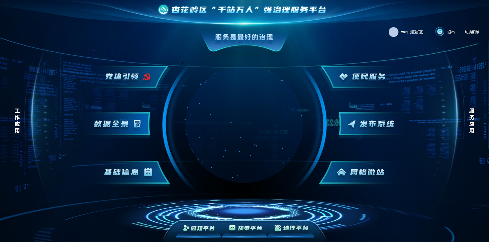
2、智慧党建，包括数据看板，党组织管理，党员管理，三会一课，学习教育，党史学习等
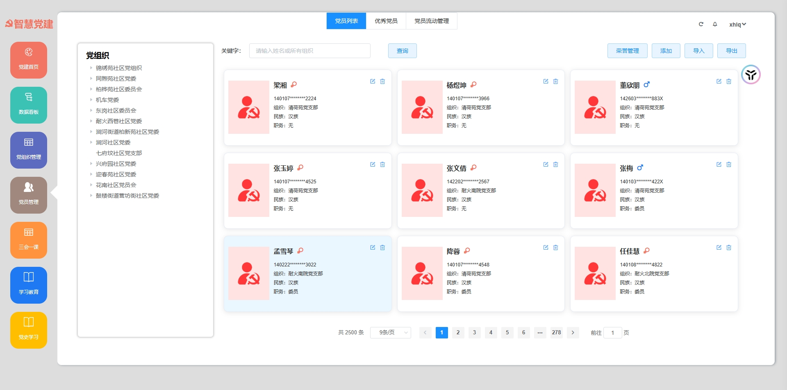
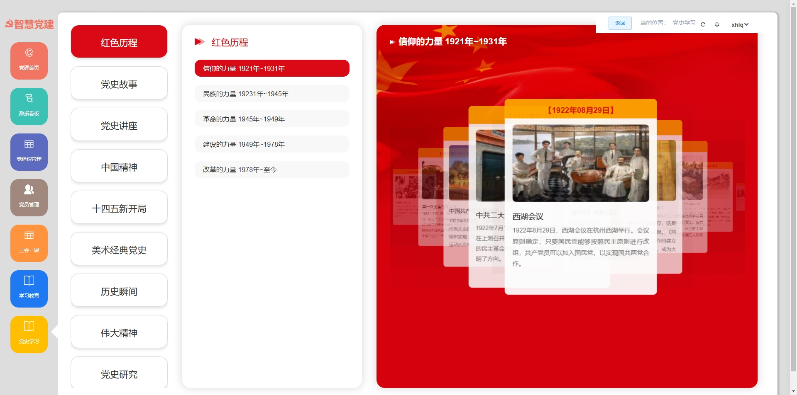
3、便民服务
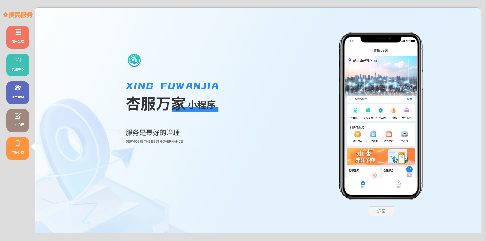
4、数据全景
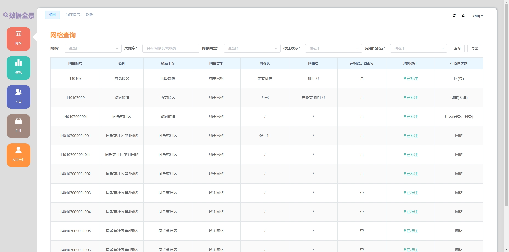
5、基础信息-网格
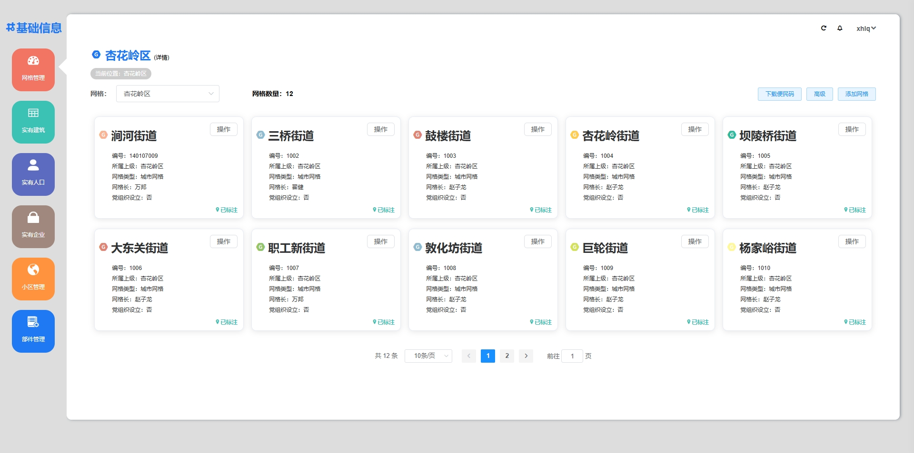
6、基础信息-建筑
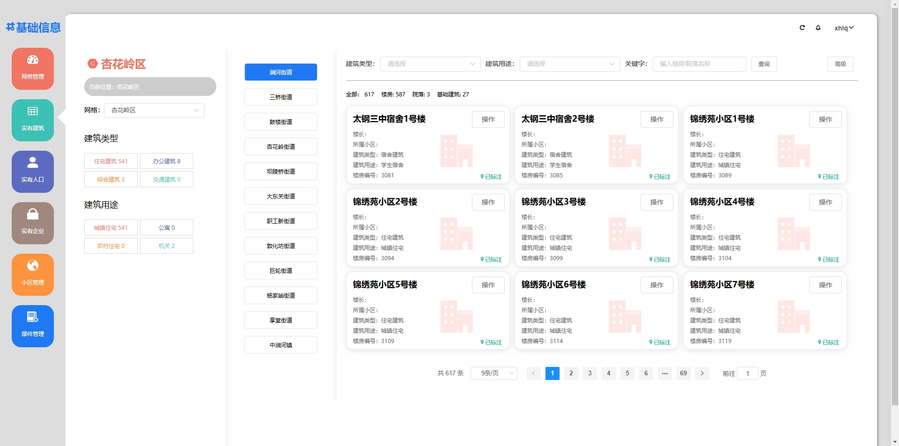
7、基础信息-人口
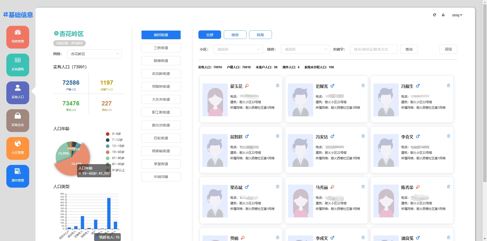
8、网格微站
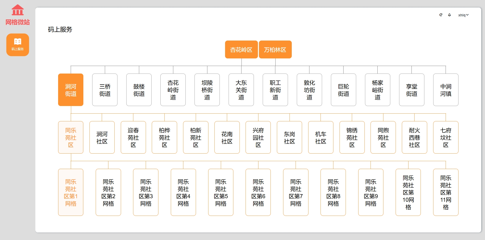
9、感知平台以及事件预警
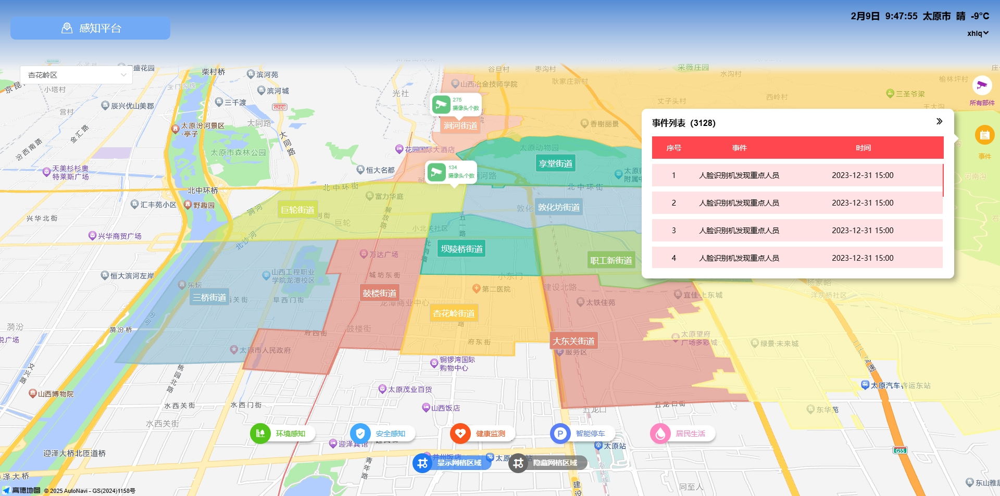
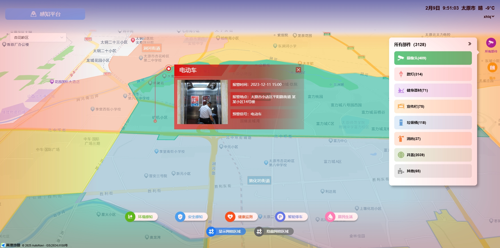
10、决策平台
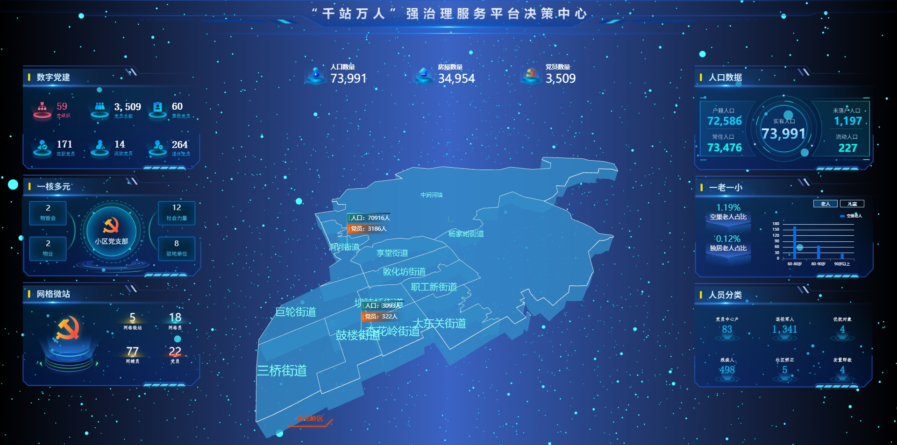
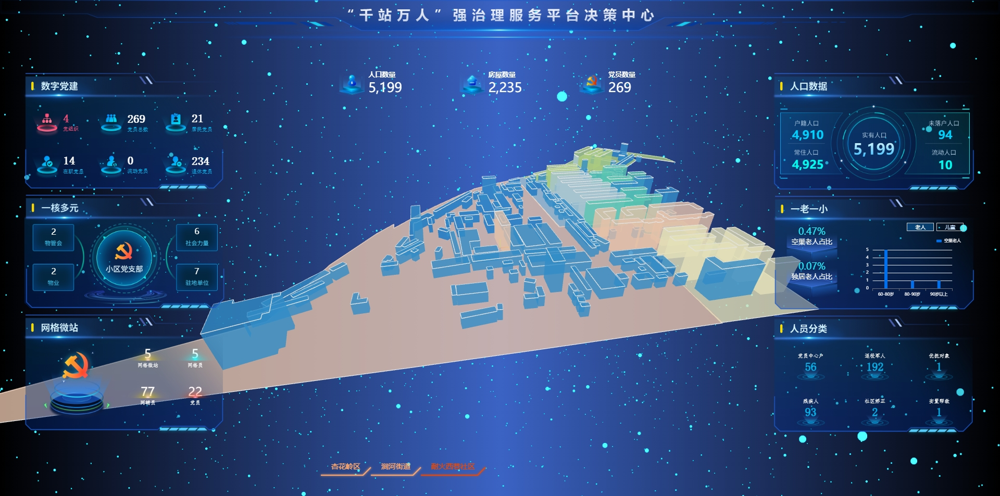
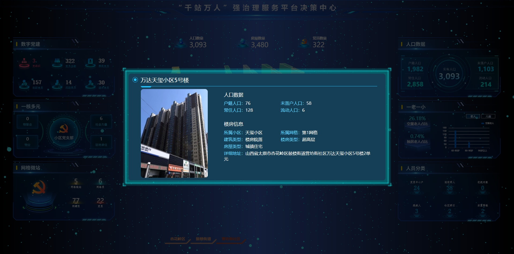
11、地理平台-人口热力图
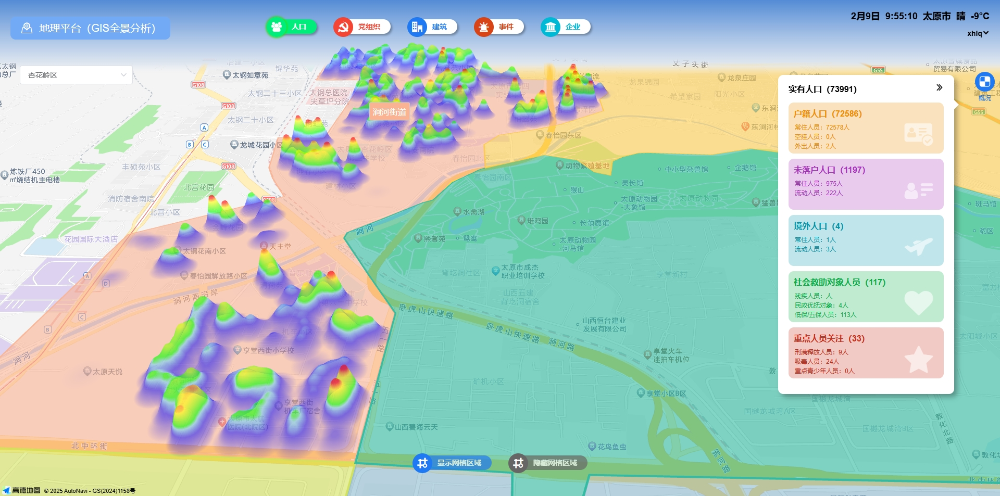

## 使用须知
***
* 标注"山西铂安电子科技开源项目"后即可免费自用运营
* 前端运营时展示的内容不得使用山西铂安电子科技相关信息
* 允许用于个人学习、教学案例
* 不得直接倒卖源码
* 禁止将本项目的代码和资源进行任何形式的出售，产生的一切任何后果责任由侵权者自负

## 合作
***
*  如果你想使用功能更完善的智慧社区系统，请联系电话：0351-7899009 或者 微信 wxid_gpsuddi241fn22
*  如果您想基于智慧社区系统进行定制开发，我们提供有偿定制服务支持！
*  其他合作模式不限，欢迎来撩！
*  联系我们（商务请联系电话：0351-7899009 或者 微信 wxid_gpsuddi241fn22）

## 关于我们
***
* 公司名称：山西铂安电子科技有限公司
* 电话：0351-7899009
* 业务合作：
* 公司主页：

## 交流咨询群

如果需要体验账号请加QQ群（288386013）

## 微信
微信联系方式：微信号 wxid_gpsuddi241fn22

